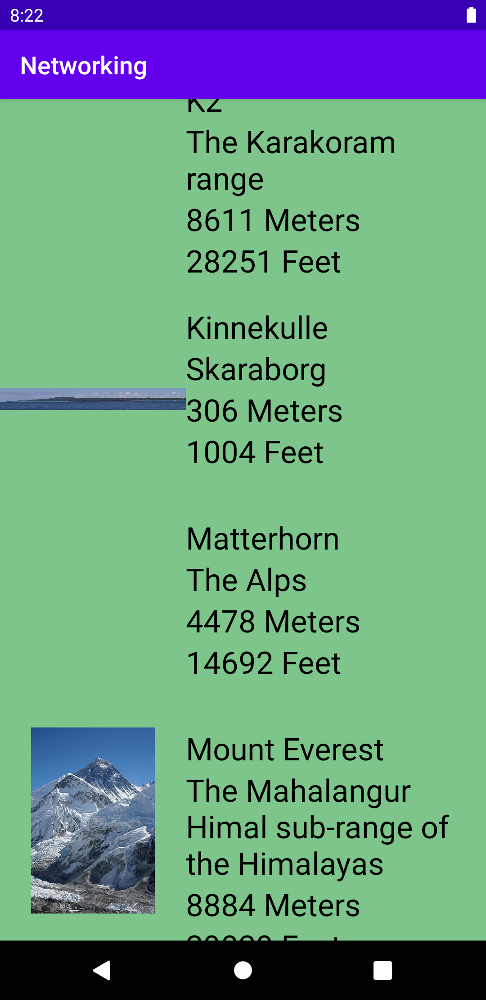

# Rapport

I denna assignment har jag skapat en recycler view i main aktiviteten. Denna recycler view visar data från en lista "Mountain" object.
Dessa object skapas utifrån data hämnat i JSON format [från](https://mobprog.webug.se/json-api?login=brom).
Genom medkomna classer kan den hämntade datan omvandlas till object och sedan skickas till recycler view adaptern för att visas.

Koden nedanför visar del av prossen för att skapa en lista av "Mountain object baserad på den data som hämntats från nätet i JSON format.
Detta görs genom GSON. 

```
    Type type = new TypeToken<List<Mountain>>() {}.getType();
    List<Mountain> listOfMountains = gson.fromJson(json, type);
    adapter.update(listOfMountains);
    adapter.notifyDataSetChanged();
```


 

